<h1 align="center">Prabal Khare</h1>

  <strong>Autonomous systems • perception • embedded control</strong> 
  Building robotic systems that move beyond simulation and into deployment.

  
  
  

<!-- ─────────────────────────── TERMINAL ────────────────────────── -->

  

<!-- ──────────────────────────── ROVER ──────────────────────────── -->

  

<!-- ──────────────────────────── STACK ──────────────────────────── -->

  
  
  
  
  
  
  
  

<!-- ──────────────────────────── SNAKE ──────────────────────────── -->

  <picture>
    <source media="(prefers-color-scheme: dark)" srcset="https://raw.githubusercontent.com/00PrabalK00/00PrabalK00/output/snake-dark.svg">
    <source media="(prefers-color-scheme: light)" srcset="https://raw.githubusercontent.com/00PrabalK00/00PrabalK00/output/snake-light.svg">
    
  </picture>

<!-- ──────────────────────────── FOOTER ─────────────────────────── -->

  <a href="https://prabalkhare.com"><b>prabalkhare.com</b></a>
  &nbsp;·&nbsp;
  <a href="https://linkedin.com/in/prabalk">LinkedIn</a>
  &nbsp;·&nbsp;
  <a href="mailto:prabalkhareofficial@gmail.com">Email</a>
  &nbsp;·&nbsp;
  <a href="https://github.com/00PrabalK00?tab=repositories">All repositories</a>

  Open to robotics roles and collaborations — autonomy, perception, embedded control.

