<!-- ───────────────────────────── HERO ───────────────────────────── -->

  <a href="https://prabalkhare.com">
    <picture>
      <source media="(prefers-color-scheme: dark)" srcset="./dark.svg">
      <source media="(prefers-color-scheme: light)" srcset="./light.svg">
      
    </picture>
  </a>

  
  
  

<!-- ──────────────────────────── ROVER ──────────────────────────── -->

  

<!-- ─────────────────────────── TERMINAL ────────────────────────── -->

  

<!-- ─────────────────────────── FEATURED ────────────────────────── -->

### Featured work

| Project | What it is | Stack |
| --- | --- | --- |
| **[RosScope](https://github.com/00PrabalK00/RosScope)** | Oscilloscope-style live debugging for ROS 2 topics and diagnostics | C++ · Qt 6 · ROS 2 |
| **[OpenRosWarehouse](https://github.com/00PrabalK00/OpenRosWarehouse)** | Warehouse autonomy stack for UGV missions, Nav2 and shelf workflows | ROS 2 · Nav2 · LiDAR |
| **[next_EKF](https://github.com/00PrabalK00/next_EKF)** | Odom + IMU fusion after Allan variance analysis of the IMU noise model | ROS 2 · Sensor fusion |
| **[Project MIRA](https://github.com/00PrabalK00/Project_MIRA_Details)** | AUV control and perception — 2nd place, TAC Norway 2024 | ROS · OpenCV · AUV |
| **[Continuum](https://github.com/00PrabalK00/Continuum)** | Local shared memory and controlled workflows for AI coding agents | Python · MCP |
| **[prabalk.dev](https://github.com/00PrabalK00/prabalk.dev)** | Portfolio — a scroll-driven 3D flight through the robots I have built | Next.js 16 · R3F |

Everything else lives in [all repositories](https://github.com/00PrabalK00?tab=repositories).

<!-- ──────────────────────────── STACK ──────────────────────────── -->

  
  
  
  
  
  
  
  

<!-- ──────────────────────────── SNAKE ──────────────────────────── -->

  <picture>
    <source media="(prefers-color-scheme: dark)" srcset="https://raw.githubusercontent.com/00PrabalK00/00PrabalK00/output/snake-dark.svg">
    <source media="(prefers-color-scheme: light)" srcset="https://raw.githubusercontent.com/00PrabalK00/00PrabalK00/output/snake-light.svg">
    
  </picture>

<!-- ──────────────────────────── FOOTER ─────────────────────────── -->

  <a href="https://prabalkhare.com"><b>prabalkhare.com</b></a>
  &nbsp;·&nbsp;
  <a href="https://linkedin.com/in/prabalk">LinkedIn</a>
  &nbsp;·&nbsp;
  <a href="mailto:prabalkhareofficial@gmail.com">Email</a>
  &nbsp;·&nbsp;
  <a href="https://github.com/00PrabalK00?tab=repositories">All repositories</a>

  Open to robotics roles and collaborations — autonomy, perception, embedded control.

